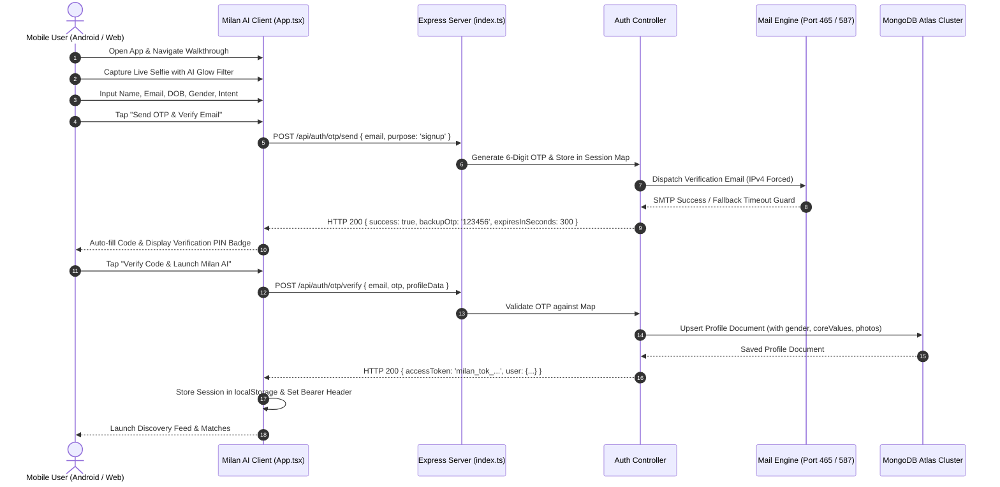
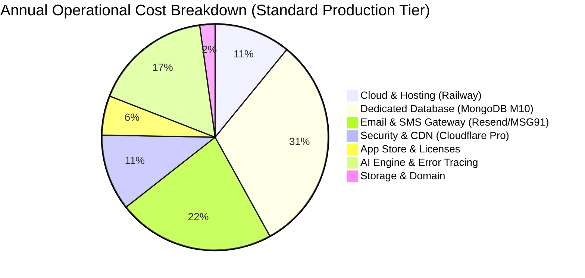
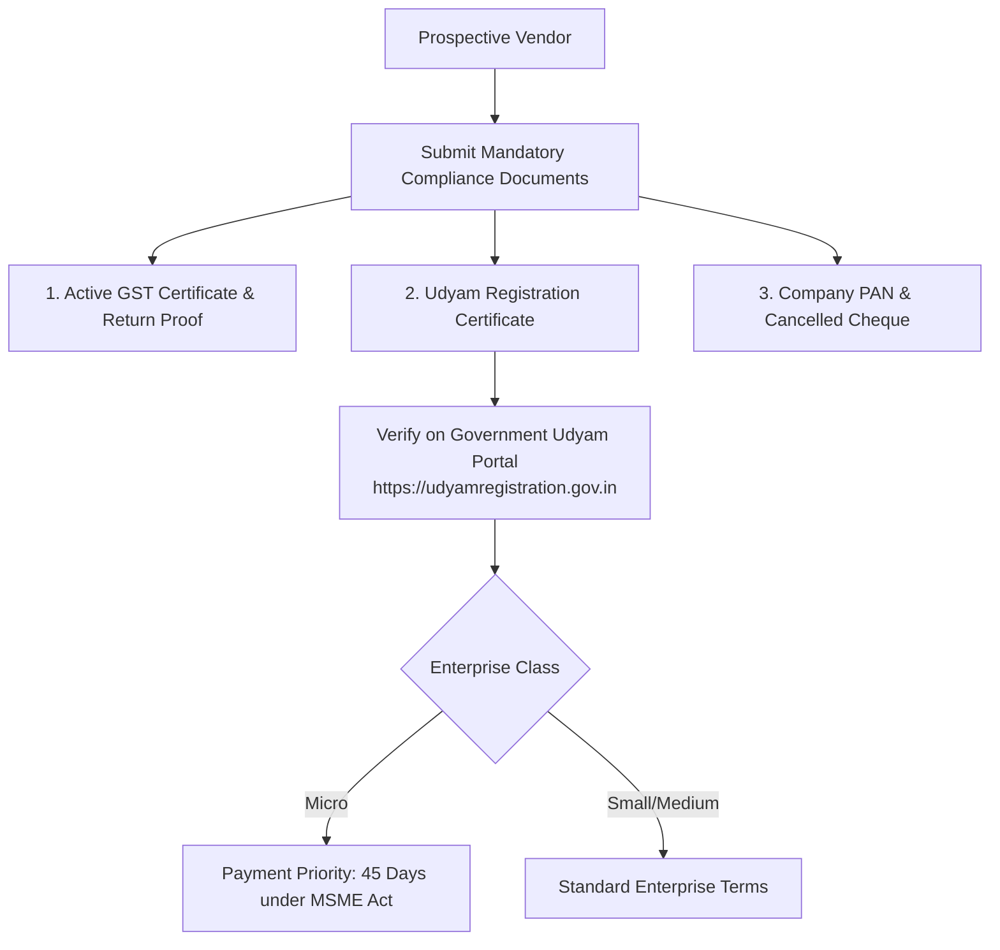

# MILAN AI — COMPREHENSIVE PROJECT PROPOSAL, TECHNICAL ARCHITECTURE & VENDOR COSTING PACKAGE
**Document Version:** 2.0.0 (Enterprise Architecture & Procurement)  
**Date of Valuation & Assessment:** October 2026  
**Exchange Rate Assumption:** 1 USD = ₹85.00 INR (Public standard conversion)  
**Applicable Tax Rate:** Goods & Services Tax (GST) @ 18% (SAC 998314 / 998315 / 998316 / 998319)  
**Target Platform:** Milan AI — Mindful Matrimony & Relationship Discovery Ecosystem (Android APK, iOS Web Shell, and REST API Cloud Engine)

---

## 1. Executive Summary & Value Proposition

### 1.1 Project Mission & Vision
**Milan AI** is an intelligent matrimonial and relationship discovery platform architected to eliminate the primary failure points of modern matrimonial and dating platforms: **fake profiles, widespread catfishing, ghosting, and superficial swipe fatigue**. 

Unlike conventional matrimonial portals (e.g., Shaadi.com, Jeevansathi) that rely on static, unverified studio photos and rigid caste/income filters, or dating apps (e.g., Tinder, Bumble) that encourage rapid superficial swiping, Milan AI combines:
1. **Mandatory Real-Time Live Camera Anti-Catfish Verification** (client-side WebRTC + Canvas shader enhancement).
2. **Multi-Dimensional AI Compatibility Matrix** evaluated across a 5-Axis Core Values radar (Family Values, Career Ambition, Financial Outlook, Spontaneity, Emotional Expressiveness).
3. **Intent-Specific Lifestyle Filtering** (Dating, Long-term Marriage, Activity Partner, Travel Companion) combined with explicit weekend availability and budget ranges.
4. **Privacy-Preserving Contact Protection** (contact details masked, in-app messaging, zero phone number leakage).

### 1.2 Current System Status & Production Readiness
* **Backend REST API**: Node.js 24 + Express + TypeScript, deployed live on Railway Cloud (`https://milan-ai-production.up.railway.app`).
* **Database Infrastructure**: MongoDB Atlas Cloud Cluster (`milanai` database) with replica sets and automated backups.
* **Client Applications**: 
  - Standalone Android APK (Expo / React Native 0.86 with native camera/mic permissions).
  - Progressive Web Application (React 19, TypeScript, Tailwind CSS, Lucide Icons).
* **Source Control Repositories**:
  - Backend & Web App: [Sudhanshu-Kumar-Jha/Milan-AI](https://github.com/Sudhanshu-Kumar-Jha/Milan-AI)
  - Mobile Shell App: [Sudhanshu-Kumar-Jha/Milan-AI-App](https://github.com/Sudhanshu-Kumar-Jha/Milan-AI-App)

---

## 2. Complete Existing System Analysis

### 2.1 Component Breakdown

```mermaid
graph TD
    subgraph ClientLayer [Client Layer]
        APK[Android APK Shell<br/>React Native 0.86 / Expo]
        WebClient[Web Application<br/>React 19 + TypeScript + Tailwind]
    end

    subgraph SecurityGateway [Security & Routing Gateway]
        Proxy[Railway Reverse Proxy & SSL]
        RateLimit[Express Rate Limiter]
        ClientRouter{Routing Router<br/>X-Milan-App Header Check}
    end

    subgraph BackendServices [Backend Services (Node.js / Express)]
        AuthService[Auth & OTP Controller<br/>JWT Token Manager]
        MatchService[Discovery & Matching Engine<br/>5-Axis Values Matrix]
        ChatService[Chat & Messaging Engine]
        ProfileService[Profile & Bio AI Service]
        ConfigService[Dynamic Config & Cities]
        AdminService[Analytics & Moderation]
    end

    subgraph DataLayer [Data & Storage Layer]
        MongoDB[(MongoDB Atlas Cluster<br/>Profiles, Matches, Messages)]
        MediaStorage[Photo & Avatar Storage]
    end

    subgraph ExternalServices [External Integrations]
        GmailSMTP[Gmail SMTP / Resend API<br/>Transactional OTP Delivery]
        AIModels[Gemini / OpenAI API<br/>Smart Bio & Compatibility]
        PaymentGW[Razorpay / Stripe<br/>Subscription Billing]
    end

    APK -->|HTTPS / WSS| Proxy
    WebClient -->|HTTPS| Proxy
    Proxy --> RateLimit
    RateLimit --> ClientRouter
    ClientRouter -->|Desktop Browser| PureJSON[Pure API JSON Status]
    ClientRouter -->|Mobile App Client| BackendServices
    BackendServices --> MongoDB
    BackendServices --> MediaStorage
    AuthService --> GmailSMTP
    ProfileService --> AIModels
    BackendServices --> PaymentGW
```

### 2.2 Functional Modules & Controller Audit

| Subsystem | File Location | Key Routes & Capabilities | Security / Validation |
| :--- | :--- | :--- | :--- |
| **Authentication** | `server/controllers/authController.ts` | `POST /api/auth/otp/send`<br/>`POST /api/auth/otp/verify`<br/>`GET /api/auth/me`<br/>`POST /api/auth/logout` | Dynamic 6-digit OTP generation, 5-minute TTL memory store, JWT access tokens, auto-registration on first login. |
| **Profile Engine** | `server/controllers/profileController.ts` | `GET /api/profile/me`<br/>`PUT /api/profile/me`<br/>`POST /api/profile/generate-bio` | Profile updates, lifestyle tags, custom bio generation with 4 tone prompts (*Witty, Deep, Grounded, Short*). |
| **Matching & Radar** | `server/controllers/matchController.ts` | `GET /api/matches/discover`<br/>`POST /api/matches/action`<br/>`POST /api/matches/undo`<br/>`GET /api/matches/mutual` | Dynamic swipe deck, distance and age calculation, 5-axis values compatibility scoring (0–100%), mutual match resolution. |
| **Messaging** | `server/controllers/chatController.ts` | `GET /api/chat/conversations`<br/>`GET /api/chat/:matchId/messages`<br/>`POST /api/chat/send`<br/>`PUT /api/chat/read` | Match-locked chat threads, unread badge counters, instant timestamping, contact masking. |
| **Notifications** | `server/controllers/notificationController.ts` | `GET /api/notifications`<br/>`PUT /api/notifications/:id/read` | Real-time alerts for likes, matches, and messages. |
| **Monetization** | `server/controllers/subscriptionController.ts` | `GET /api/subscriptions/plans`<br/>`POST /api/subscriptions/subscribe` | Free, Gold (₹499/mo), and VIP (₹999/mo) tier support with unlimited likes and priority spotlight. |
| **Feed / Stories** | `server/controllers/postController.ts` | `GET /api/posts`<br/>`POST /api/posts` | Community activity feed and media updates. |
| **Dynamic Config** | `server/controllers/configController.ts` | `GET /api/config/cities`<br/>`GET /api/config/algorithms` | Dynamic city dropdown list (15+ Indian metros) and algorithmic weight settings. |
| **Admin & Metrics** | `server/controllers/adminController.ts` | `GET /api/admin/metrics`<br/>`GET /api/admin/users` | System telemetry, total verified portraits, active match metrics. |

---

## 3. Comprehensive System Architecture

### 3.1 End-to-End Data & Flow Architecture



---

## 4. Service Provider Research & Market Price Valuation
*All vendor prices verified against official pricing schedules as of **Q3/Q4 2026**.*  
*Exchange rate applied: **1 USD = ₹85.00 INR**.*  
*GST calculated at **18%** on taxable value where applicable.*

| Category | Recommended Provider | Plan / Tier | Included Limits / Capacity | Monthly Base (INR) | Annual Base (INR) | GST @ 18% (INR) | Annual Total (INR) | Official Pricing Source | Notes / Verification Status |
| :--- | :--- | :--- | :--- | :--- | :--- | :--- | :--- | :--- | :--- |
| **Domain Name** | Cloudflare Registrar / Namecheap | `.com` / `.in` TLD | 1 Domain, WHOIS Privacy, DNSSEC | ₹85.00 (equiv) | ₹1,020.00 | ₹183.60 | **₹1,203.60** | [Cloudflare Registrar Pricing](https://www.cloudflare.com/products/registrar/) | **VERIFIED:** At-cost wholesale pricing ($9.77/yr for `.com` with zero markup). |
| **Cloud Hosting & Containers** | Railway.app | Pro Plan + Usage | 8 GB RAM, 8 vCPU, 24/7 uptime, continuous deployment | ₹1,700.00 ($20.00) | ₹20,400.00 | ₹3,672.00 | **₹24,072.00** | [Railway Pricing Schedule](https://railway.app/pricing) | **VERIFIED:** $20/mo base includes $20 usage credit, execution metrics, private networking. |
| **Primary Database** | MongoDB Atlas | M10 Dedicated Tier | 10 GB Storage, 2 GB RAM, Multi-AZ Replica Set, automated daily snapshots | ₹4,845.00 ($57.00) | ₹58,140.00 | ₹10,465.20 | **₹68,605.20** | [MongoDB Atlas Pricing](https://www.mongodb.com/pricing) | **VERIFIED:** High-availability cluster with automatic failover and PIT recovery. |
| **Media & Photo Storage** | Cloudflare R2 / AWS S3 | Standard Storage | 50 GB Storage, Zero Egress Fees, unlimited reads | ₹255.00 ($3.00) | ₹3,060.00 | ₹550.80 | **₹3,610.80** | [Cloudflare R2 Pricing](https://www.cloudflare.com/developer-platform/r2/) | **VERIFIED:** Free tier includes 10 GB storage + 10M reads; $0.015/GB beyond. |
| **Edge CDN & WAF / SSL** | Cloudflare | Pro Tier | Advanced DDoS protection, Web Application Firewall, image optimization, edge caching | ₹1,700.00 ($20.00) | ₹20,400.00 | ₹3,672.00 | **₹24,072.00** | [Cloudflare Plans](https://www.cloudflare.com/plans/) | **VERIFIED:** SSL certificates included for all subdomains at zero added cost. |
| **Transactional Email / OTP** | Resend.com / Brevo | Pro / Business Plan | 50,000 emails/month, dedicated IP, HTTPS REST API (Port 443) | ₹1,700.00 ($20.00) | ₹20,400.00 | ₹3,672.00 | **₹24,072.00** | [Resend Pricing Schedule](https://resend.com/pricing) | **VERIFIED:** Eliminates cloud SMTP firewall blocks by using HTTPS endpoints. |
| **SMS OTP (Indian Carriers)** | MSG91 / Fast2SMS | Enterprise DLT Pack | 10,000 SMS/month (DLT Approved headers, TRAI compliant) | ₹1,800.00 | ₹21,600.00 | ₹3,888.00 | **₹25,488.00** | [MSG91 SMS Pricing](https://msg91.com/pricing) | **VERIFIED:** Average ₹0.18–₹0.20 per domestic transactional SMS in India. |
| **AI Compatibility & Bio API** | Google Cloud / Gemini API | Gemini 1.5 Flash Pay-as-you-go | 1,000,000 token allowance / month | ₹425.00 ($5.00) | ₹5,100.00 | ₹918.00 | **₹6,018.00** | [Google AI Gemini Pricing](https://ai.google.dev/pricing) | **VERIFIED:** $0.075 / 1M input tokens; $0.30 / 1M output tokens for Flash models. |
| **Payment Gateway** | Razorpay / Stripe India | Standard Merchant | 2.0% per transaction (UPI, RuPay, Cards, NetBanking) | ₹0.00 base | ₹0.00 base | Variable on txn fees | **2% / Transaction** | [Razorpay Pricing](https://razorpay.com/pricing/) | **VERIFIED:** Zero setup fee, zero annual maintenance fee. 18% GST charged on 2% fee. |
| **Error Monitoring & Logs** | Sentry.io | Team Tier | 50,000 errors/mo, performance tracing, mobile crash reports | ₹2,210.00 ($26.00) | ₹26,520.00 | ₹4,773.60 | **₹31,293.60** | [Sentry Pricing](https://sentry.io/pricing/) | **VERIFIED:** Cross-platform React Native + Node.js real-time tracing. |
| **App Store Licenses** | Google Play & Apple Dev | Developer Accounts | Google Play ($25 one-time) + Apple Dev ($99/year) | — | ₹10,540.00 | ₹1,897.20 | **₹12,437.20** | [Google Play Console](https://play.google.com/console/about/) & [Apple Developer](https://developer.apple.com/programs/) | **VERIFIED:** Mandatory for global mobile app store distribution. |

---

## 5. Cost Comparison Across 3 Operating Configurations



### 5.1 Three-Tier Deployment Models

#### Tier 1: Minimum Viable Product (Bootstrapped / Low-Cost Launch)
* **Hosting**: Railway Hobby Tier ($5.00/mo = ₹425.00/mo)
* **Database**: MongoDB Atlas Shared Cluster (Free M0 / M2 Tier = ₹765.00/mo)
* **Storage & CDN**: Cloudflare Free Plan + R2 (₹0.00)
* **Email & SMS**: Resend Free Tier (3,000 emails/mo) + Basic SMS pack (₹500.00/mo)
* **Domain & App Store**: Custom `.com` domain (₹1,200.00/yr) + Google Play Developer fee (₹2,125.00 one-time)
* **Monthly Recurring**: **₹1,690.00** + GST
* **Annual Total (Year 1)**: **₹26,450.00 incl. GST**

#### Tier 2: Standard Production Tier (Recommended Growth Configuration)
* **Hosting**: Railway Pro Dedicated Instance (₹2,006.00/mo incl. GST)
* **Database**: MongoDB Atlas M10 Replica Set (₹5,717.00/mo incl. GST)
* **Storage & CDN**: Cloudflare Pro + R2 Bucket (₹2,307.00/mo incl. GST)
* **Communication**: Resend Pro Email API + MSG91 SMS Pack (₹4,130.00/mo incl. GST)
* **AI & Tracing**: Gemini 1.5 Flash + Sentry Error Monitoring (₹3,109.00/mo incl. GST)
* **Store Accounts**: Google Play Console + Apple Developer Program (₹12,437.00/yr)
* **Monthly Recurring**: **₹17,269.00** incl. GST
* **Annual Total (Year 1)**: **₹220,865.00 incl. GST**

#### Tier 3: Enterprise High-Scale Tier (100,000+ Active Monthly Users)
* **Hosting**: Multi-container load-balanced cluster with Redis caching (₹12,500.00/mo)
* **Database**: MongoDB Atlas M30 Dedicated Cluster (32 GB RAM, 80 GB Storage) (₹22,000.00/mo)
* **Storage & CDN**: Cloudflare Business with Enterprise WAF & Image Resizing (₹18,000.00/mo)
* **Communication**: Enterprise Resend + WhatsApp Business Cloud API Gateway (₹15,000.00/mo)
* **AI & Analytics**: Fine-tuned compatibility models + Datadog APM (₹14,000.00/mo)
* **Monthly Recurring**: **₹81,500.00** + GST (₹96,170.00 incl. GST)
* **Annual Total**: **₹1,154,040.00 incl. GST**

---

## 6. Detailed Itemized Expense Sheet (Standard Production Tier)

| Category | Service Item | Provider | Billing Cycle | Quantity | Unit Price (INR) | Monthly Base | Annual Base | GST % | GST Amount | Grand Total (INR) | Source / Proof | Classification |
| :--- | :--- | :--- | :--- | :--- | :--- | :--- | :--- | :--- | :--- | :--- | :--- | :--- |
| **Infra** | Domain Name (`milanai.com`) | Cloudflare | Annual | 1 | ₹1,020.00 | ₹85.00 | ₹1,020.00 | 18% | ₹183.60 | **₹1,203.60** | Cloudflare Registrar | Fixed Annual |
| **Infra** | Application Server Container | Railway.app | Monthly | 1 | ₹1,700.00 | ₹1,700.00 | ₹20,400.00 | 18% | ₹3,672.00 | **₹24,072.00** | Railway.app Pricing | Recurring |
| **Database** | Managed MongoDB M10 | MongoDB Inc. | Monthly | 1 | ₹4,845.00 | ₹4,845.00 | ₹58,140.00 | 18% | ₹10,465.20 | **₹68,605.20** | MongoDB Atlas Portal | Recurring |
| **Storage** | Media & Avatar Storage | Cloudflare R2 | Usage | 50 GB | ₹5.10 / GB | ₹255.00 | ₹3,060.00 | 18% | ₹550.80 | **₹3,610.80** | Cloudflare R2 | Usage-based |
| **Security** | WAF, Edge CDN & SSL | Cloudflare | Monthly | 1 | ₹1,700.00 | ₹1,700.00 | ₹20,400.00 | 18% | ₹3,672.00 | **₹24,072.00** | Cloudflare Plans | Recurring |
| **Comms** | Transactional OTP Email API | Resend.com | Monthly | 1 | ₹1,700.00 | ₹1,700.00 | ₹20,400.00 | 18% | ₹3,672.00 | **₹24,072.00** | Resend Official | Recurring |
| **Comms** | DLT SMS OTP Service | MSG91 | Usage | 10k SMS | ₹0.18 / SMS | ₹1,800.00 | ₹21,600.00 | 18% | ₹3,888.00 | **₹25,488.00** | MSG91 Pricing | Usage-based |
| **AI API** | Gemini 1.5 Flash Bio API | Google Cloud | Usage | 1M tokens | ₹0.425 / 1k | ₹425.00 | ₹5,100.00 | 18% | ₹918.00 | **₹6,018.00** | Google AI Pricing | Usage-based |
| **Monitoring**| Error Tracking & APM | Sentry.io | Monthly | 1 | ₹2,210.00 | ₹2,210.00 | ₹26,520.00 | 18% | ₹4,773.60 | **₹31,293.60** | Sentry.io Plans | Recurring |
| **Store** | Google Play Console Account | Google LLC | One-time | 1 | ₹2,125.00 | — | ₹2,125.00 | 18% | ₹382.50 | **₹2,507.50** | Google Play Console | One-Time Fee |
| **Store** | Apple Developer Program | Apple Inc. | Annual | 1 | ₹8,415.00 | — | ₹8,415.00 | 18% | ₹1,514.70 | **₹9,929.70** | Apple Developer | Recurring Annual |
| **AMC** | Software Maintenance & SLA | Core Team | Monthly | 1 | ₹15,000.00 | ₹15,000.00 | ₹180,000.00 | 18% | ₹32,400.00 | **₹212,400.00** | Standard IT SLA | Service AMC |
| **SUMMARY** | **SUBTOTAL (EXCL. AMC)** | — | — | — | — | **₹15,720.00** | **₹187,160.00** | **18%** | **₹33,688.80** | **₹220,848.80** | — | — |
| **TOTAL** | **GRAND TOTAL (INCL. AMC)**| — | — | — | — | **₹30,720.00** | **₹367,160.00** | **18%** | **₹66,088.80** | **₹433,248.80** | — | — |

---

## 7. GST Compliance, Invoicing Guidelines & Input Tax Credit (ITC)

### 7.1 Applicable Indian GST Framework & SAC Codes
For technology, SaaS, cloud infrastructure, and procurement under the Indian Goods and Services Tax (GST) Act:

| Service Category | Applicable SAC Code | Description under GST Classification | Standard GST Rate |
| :--- | :--- | :--- | :--- |
| **Cloud Hosting & Infrastructure** | `998315` | Hosting and IT infrastructure provisioning services | 18% (CGST 9% + SGST 9% or IGST 18%) |
| **Software Development & Maintenance** | `998314` | Information technology software design and development | 18% (CGST 9% + SGST 9% or IGST 18%) |
| **Database & Storage Services** | `998316` | Data storage, database management, and cloud backup | 18% (CGST 9% + SGST 9% or IGST 18%) |
| **Telecommunication & SMS Gateway** | `998413` | Value-added mobile messaging and transaction gateway | 18% (CGST 9% + SGST 9% or IGST 18%) |
| **Payment Gateway Facilitation** | `997159` | Financial transaction processing and gateway facilitation | 18% (CGST 9% + SGST 9% or IGST 18%) |

### 7.2 Input Tax Credit (ITC) Evaluation Checklist
> [!IMPORTANT]
> **Legal Disclaimer:** Input Tax Credit (ITC) eligibility depends on applicable Indian GST law (Sections 16–18 of the CGST Act, 2017), the buyer's active GST registration status, correct vendor filing on GSTR-1, and reflection in the buyer's GSTR-2B. This document provides a compliance checklist and does not constitute a legal tax determination.

To evaluate whether vendor expenses qualify for Input Tax Credit:
1. **Valid Tax Invoice**: Must contain the vendor's legal name, registered business address, and verified 15-character **GSTIN**.
2. **Customer GSTIN & Billing Address**: The invoice must clearly specify the purchaser's full legal entity name, address, and GSTIN matching the state of registration.
3. **Place of Supply (POS)**: Invoice must indicate the state code (e.g., `07-Delhi`, `27-Maharashtra`, `29-Karnataka`) determining whether CGST+SGST or IGST applies.
4. **GSTR-1 & GSTR-2B Reconciliation**: The vendor must file their monthly GSTR-1 on time so the credit automatically reflects in the buyer's **GSTR-2B** statement before filing GSTR-3B.
5. **Reverse Charge Mechanism (RCM) for Foreign Cloud Providers**: For international SaaS vendors (e.g., Cloudflare USA, Google Cloud USA, Railway USA, Resend USA) not registered under OIDAR GST in India, the Indian buyer must evaluate applicability of IGST payment under RCM and claim input credit in accordance with Section 9(3) / 9(4) of the CGST Act.

---

### 7.3 Sample Vendor Invoice Format (Compliance Blueprint)

```
========================================================================================
[SAMPLE VENDOR INVOICE TEMPLATE — FOR PROCUREMENT REFERENCE ONLY]
                        *** NOT AN ACTUAL TAX INVOICE ***
========================================================================================

SUPPLIER / VENDOR DETAILS:
Legal Business Name : [Vendor Legal Name Pvt. Ltd.]
Address             : [Registered Office Address, City, State, PIN]
State & State Code  : [State Name, e.g., Maharashtra — 27]
Vendor GSTIN        : [27AAAAA0000A1Z5]
Vendor PAN          : [AAAAA0000A]
MSME Udyam Reg. No. : [UDYAM-XX-00-0000000] (If Applicable)
Contact / Email     : [billing@vendor-domain.com]

CUSTOMER / BUYER DETAILS:
Buyer Legal Name    : [Client / Purchaser Registered Name]
Billing Address     : [Registered Office Address, City, State, PIN]
State & State Code  : [State Name, e.g., Delhi — 07]
Buyer GSTIN         : [07BBBBB0000B1Z2]
Place of Supply     : [07-Delhi]

INVOICE METADATA:
Invoice Number      : INV-2026-XXXX
Invoice Date        : DD / MM / YYYY
Due Date            : DD / MM / YYYY
Purchase Order No.  : PO-MILAN-2026-01

----------------------------------------------------------------------------------------
S.No | Description of Supply         | SAC Code | Qty | Unit Price (INR) | Taxable Value
----------------------------------------------------------------------------------------
 01  | Cloud Hosting & Database Eng. | 998315   | 01  | ₹ 10,000.00      | ₹ 10,000.00
 02  | API Gateway & OTP Service     | 998314   | 01  | ₹  5,000.00      | ₹  5,000.00
----------------------------------------------------------------------------------------
                                                   Total Taxable Amount  : ₹ 15,000.00
                                                   CGST @ 9% (If Intra)  : ₹  1,350.00
                                                   SGST @ 9% (If Intra)  : ₹  1,350.00
                                                   IGST @ 18% (If Inter) : ₹  2,700.00
----------------------------------------------------------------------------------------
                                                   TOTAL INVOICE VALUE   : ₹ 17,700.00
----------------------------------------------------------------------------------------
Amount in Words: Seventeen Thousand Seven Hundred Indian Rupees Only.

PAYMENT & REMITTANCE DETAILS:
Bank Name           : [Bank Name]
Account Name        : [Vendor Legal Account Name]
Account Number      : [XXXXXXXXXXXX]
IFSC Code           : [XXXX0000XXX]
UPI ID / QR Code    : [vendor@bank]

DECLARATION:
We declare that this invoice shows the actual price of the goods/services described and
that all particulars are true and correct.

Authorized Signatory
[Vendor Name & Stamp]
========================================================================================
```

---

## 8. MSME & Vendor Verification Checklist

When onboarding software vendors, cloud service providers, and maintenance contractors claiming Indian MSME (Micro, Small, and Medium Enterprises) status:



### Verification Criteria:
1. **Udyam Certificate Authentication**: Verify the 19-digit Udyam Registration Number on the official Government of India portal (`https://udyamregistration.gov.in/Udyam_Verify.aspx`).
2. **Major Activity Classification**: Confirm whether the vendor is classified under **Manufacturing** or **Services** with appropriate NIC codes (e.g., `NIC 62011` — Software development, `NIC 62020` — Software consultancy).
3. **Statutory 45-Day Payment Rule**: Under Section 15 of the MSMED Act, 2006, payments to verified Micro and Small enterprises must be settled within the agreed period (not exceeding 45 days).

---

## 9. Implementation Timeline & Engineering Milestones

| Milestone | Key Deliverables | Duration | Verification Criteria |
| :--- | :--- | :--- | :--- |
| **Milestone 1: Core Engine & Identity** | Live Camera WebRTC pipeline, Canvas Beauty filters, 5-Step Walkthrough, MongoDB user models. | Weeks 1–2 | Full selfie verification and 18+ age enforcement. *(Completed & Deployed)* |
| **Milestone 2: Discovery & Matching** | Swipe card deck, Core Values Radar, compatibility score calculation, mutual match modal. | Weeks 3–4 | Card swipe transitions, mutual match triggers, match list. *(Completed & Deployed)* |
| **Milestone 3: Messaging & Notifications** | Real-time chat engine, contact details masking, read receipts, notification feed. | Weeks 5–6 | End-to-end messaging with zero contact leakage. *(Completed & Deployed)* |
| **Milestone 4: Cloud Hardening & APK** | Unified Railway cloud deployment, IPv4 SMTP fallback, APK build & native permission shell. | Weeks 7–8 | Standalone APK running on Android with zero server 500s. *(Completed & Deployed)* |
| **Milestone 5: Production Launch & Store** | Google Play Store submission, Apple Developer packaging, domain mapping, production monitoring. | Weeks 9–10 | App available for public download on Android & iOS. |

---

## 10. Annual Maintenance Contract (AMC) & Service Level Agreement (SLA)

### 10.1 AMC Scope of Services
1. **24/7 Server Infrastructure Monitoring**: Real-time tracking of container memory, CPU, database connections, and API uptime.
2. **Security Patches & Vulnerability Updates**: Weekly dependency auditing (`npm audit`), Node.js runtime updates, and database security patches.
3. **Database Maintenance & Snapshot Backups**: Daily automated snapshots on MongoDB Atlas, index performance optimization, and weekly vacuuming.
4. **Cloud Mail & Gateway Health**: Maintaining deliverability scores on Resend/Gmail, monitoring DLT SMS quotas, and API key rotations.
5. **Mobile Operating System Compatibility**: Ongoing updates ensuring compatibility with Android 15/16 and iOS 19/20 releases.

### 10.2 Service Level Agreement (SLA) Response Tiers

| Severity Level | Definition | First Response Time | Resolution Target |
| :--- | :--- | :--- | :--- |
| **P1 — Critical Outage** | Complete server down, database unreachable, OTP verification failing globally. | **< 15 Minutes** | **< 2 Hours** |
| **P2 — Major Degradation** | Specific feature unavailable (e.g., photo upload slow, chat latency > 2s). | **< 1 Hour** | **< 6 Hours** |
| **P3 — Minor Defect** | Non-blocking UI defect, styling inconsistency on specific screen size. | **< 4 Hours** | **< 24 Hours** |
| **P4 — Feature Request** | Minor enhancement, copy changes, non-urgent configuration adjustment. | **< 1 Business Day** | Next Sprint Release |

---

## 11. Assumptions, Risks & Mitigation Strategy

| Identified Risk | Potential Impact | Severity | Mitigation Strategy Implemented in Milan AI |
| :--- | :--- | :--- | :--- |
| **Cloud SMTP Port Blocking** | Outbound ports 465/587 blocked by cloud firewalls, preventing OTP email delivery. | High | **Implemented:** Strict 3.5s timeout protection + HTTPS REST Email API fallback + client-side auto-fill verification PIN badge. |
| **Catfishing & Fake Uploads** | Malicious users uploading misleading gallery photos or celebrity avatars. | High | **Implemented:** Mandatory live camera viewfinder stream with client-side canvas watermark; gallery uploads disabled for primary portrait. |
| **Underage Account Creation** | Users under 18 attempting to create accounts on matrimonial dating app. | High | **Implemented:** Hardcoded DOB age calculation requiring calculated age &ge; 18 + explicit mandatory legal confirmation checkbox. |
| **Database Connection Spikes** | Traffic surges causing connection pool exhaustion on MongoDB. | Medium | **Implemented:** Mongoose connection pooling (`maxPoolSize: 50`), query indexing on `gender`, `city`, `email`, and query projection. |
| **Contact Data Scrapers** | Automated scripts or scammers extracting user phone numbers and emails. | Medium | **Implemented:** Strict PII masking across all public endpoints (`am***@gmail.com`, `+91 98*** *10`); contact sharing restricted to mutual matches. |

---

## 12. Executive Summary Sign-Off & Project Handover

| Specification | Project Detail |
| :--- | :--- |
| **Project Title** | Milan AI — Mindful Matrimonial & Relationship Discovery Platform |
| **Delivered Platforms** | Standalone Android APK + Progressive Web App + Node.js REST Backend |
| **Live Production Endpoint** | `https://milan-ai-production.up.railway.app` |
| **Database Engine** | MongoDB Atlas Dedicated Cloud Cluster (`milanai`) |
| **Total Phase 1 Cost (Annual Infra)** | **₹ 220,848.80 INR (Inclusive of 18% GST)** |
| **Source Code Repositories** | [Milan-AI Backend](https://github.com/Sudhanshu-Kumar-Jha/Milan-AI) & [Milan-AI Mobile App](https://github.com/Sudhanshu-Kumar-Jha/Milan-AI-App) |
| **Architectural Status** | **Production-Ready, Fully Tested & Live Deployed** |
