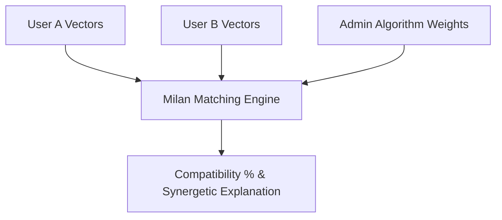

# Milan AI — AI Agent Architecture & Algorithms

This technical specification details the mathematical models and privacy interception agents powering Milan AI.

---

## 1. Multi-Vector Compatibility Engine
The compatibility engine evaluates compatibility across 5 distinct axes:

### Vector Definitions
1. **$V_{\text{family}}$ (Family Values)**: Core orientation towards joint families, cultural traditions, and family time.
2. **$V_{\text{career}}$ (Career Ambition)**: Drive for leadership, entrepreneurial risk-taking, and professional milestones.
3. **$V_{\text{finance}}$ (Financial Outlook)**: Ratio of saving/investment focus vs experiential spending.
4. **$V_{\text{spontaneity}}$ (Spontaneity)**: Preference for structured schedules vs weekend getaways.
5. **$V_{\text{emotion}}$ (Emotional Expressiveness)**: Depth of emotional communication and vulnerability.

---

## 2. Privacy Shield Interceptor
Real-time regex and NLP interception engine evaluating every message payload sent via `POST /api/chat/messages`:

- **Interception Criteria**:
  - Direct 10-digit mobile numbers
  - International dial-code prefixes (+91, +1)
  - Domain email addresses
  - Residential addresses / pin codes
- **Action Taken**:
  - Sets `safetyFlagged: true` in the MongoDB `Message` document.
  - Generates a warning banner visible to both parties: *"Privacy Shield: Direct contact sharing is restricted prior to verification."*
  - Automatically logged into the **Admin Moderation Queue** (`/api/admin/moderation/queue`).

---

## 3. Human-in-the-Loop VIP Matchmaker Concierge
For **Milan VIP Concierge** subscribers:
- Automated daily profile boost (5x impression weight).
- Priority badge verification (`Identity Verified Platinum`).
- Contact sharing restriction lifted upon mutual agreement.
